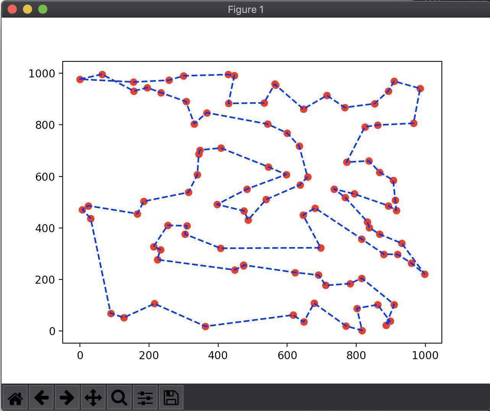
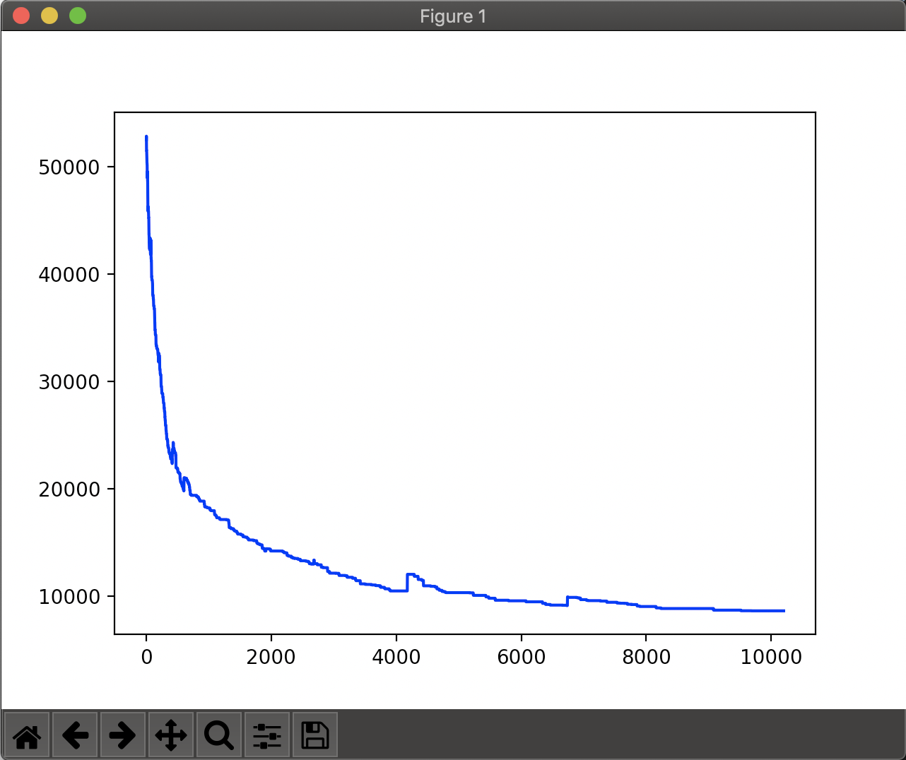

# List Based Simmulated Annealing (LBSA) for Travelling Salesman Problem (TSP)
A collage task, repo. Implemetation of a Paper Research.

## Prequisite
1. Python 3
2. Python library `matplotlib`

## How To Use
1. Define your test case in file `./data.in`
    - You can define multiple test case on the file
    - first line, n, indicate how many test case in the file
    - next line, m, indicate how many city in TSP problem
    - following m line is the coordinate (x,y) of each city
    - next line is the optimal distance for the current TSP solution
    - next is repitition of test case for n times
2. You can customize the running variable on `config.py`
    - `DATA_FILE` is to define the location file for another testcase
    - `SHOW_VISUAL` is to let python know if you want to see the visual result
    - `is_debug` is to show the running progress
3. run `python3 main.py`, see final solution and distance on your terminal
4. if you change something on the code, dont forget to run the test

## Result
### Map and Track

### Distance (y) to Iteration (x)

## Abstract
Simulated annealing (SA) algorithm is a popular intelligent optimization algorithm which has been successfully applied in many fields. Parameters’ setting is a key factor for its performance, but it is also a tedious work. To simplify parameters setting, we present a list-based simulated annealing (LBSA) algorithm to solve traveling salesman problem (TSP). LBSA algorithm uses a novel list-based cooling schedule to control the decrease of temperature. Specifically, a list of temperatures is created first, and then the maximum temperature in list is used by Metropolis acceptance criterion to decide whether to accept a candidate solution. The temperature list is adapted iteratively according to the topology of the solution space of the problem. The effectiveness and the parameter sensitivity of the list-based cooling schedule are illustrated through benchmark TSP problems. The LBSA algorithm, whose performance is robust on a wide range of parameter values, shows competitive performance compared with some other state-of-the-art algorithms. 

## Reference
Zhan, Shi-hua & Lin, Sannuo & Zhang, Ze-jun & Zhong, Yiwen. (2016). List-Based Simulated Annealing Algorithm for Traveling Salesman Problem. Computational Intelligence and Neuroscience. 2016. 1-12. 10.1155/2016/1712630. 